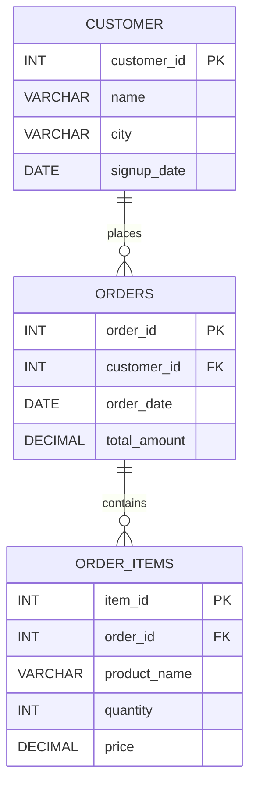

## Project Status

This project demonstrates SQL-based e-commerce data analysis and business insights.

## Key Insights

The project focuses on analyzing e-commerce sales data and generating useful business insights using SQL.

## 🧩 Database ER Diagram


# 🛒 SQL E-Commerce Analytics Project

## 📌 Project Preview

This project demonstrates real-world SQL analytics on an e-commerce dataset.
It focuses on extracting meaningful business insights using advanced SQL techniques, including ranking analysis, customer behavior tracking, and query performance optimization.

The project simulates how companies analyze customer transactions, revenue trends, and product sales using relational databases.

---

## 🎯 Project Objectives

* Analyze customer purchasing behavior
* Identify top revenue-generating customers
* Track monthly business performance
* Evaluate product sales trends
* Optimize query performance for large datasets

---

## 🗄 Database Schema

The system consists of three relational tables:

| Table           | Description                                           |
| --------------- | ----------------------------------------------------- |
| **customer**    | Stores customer details and signup information        |
| **orders**      | Contains order transactions and total purchase amount |
| **order_items** | Includes product-level details for each order         |

Relationships:

* One customer → many orders
* One order → many order items

---

## 📊 Business Analysis Performed

* Total customer and order analysis
* Customer lifetime spending calculation
* Top spending customer ranking
* Monthly revenue tracking
* Product sales performance analysis
* Order trend analysis over time

---

## ⚡ Advanced SQL Techniques Used

* Window Functions (`ROW_NUMBER`, `RANK`, `LAG`)
* Common Table Expressions (CTE)
* Subqueries and aggregations
* Join operations for relational analysis
* Date-based grouping and time series analysis

---

## 🚀 Performance Optimization

* Index created on `order_date` to improve filtering performance
* Materialized view implemented for monthly revenue reporting
* Query execution analysis using `EXPLAIN ANALYZE`

---

## 🧠 Key Insights Generated

* Identified highest revenue-generating months
* Ranked top-value customers based on spending
* Detected purchasing patterns over time
* Measured product demand trends

---

## 🛠 Technologies Used

* PostgreSQL
* SQL (Advanced Querying & Optimization)

---

## 📁 Project Structure

```
sql-ecommerce-analytics-project
│
├── schema.sql                 # Database schema definition
├── data.sql                   # Sample data insertion
├── analysis_queries.sql       # Business analysis queries
└── README.md                  # Project documentation
```

---

## ▶ How to Run This Project

1. Execute `schema.sql` to create database tables
2. Run `data.sql` to populate sample data
3. Execute `analysis_queries.sql` to perform analysis

---

## 💼 Skills Demonstrated

* Relational database design
* Business data analysis using SQL
* Analytical query writing
* Performance optimization
* Reporting automation

---

## 👨‍💻 Author

Sohel Ali


---

## ⭐ If you found this project useful, consider giving it a star!


